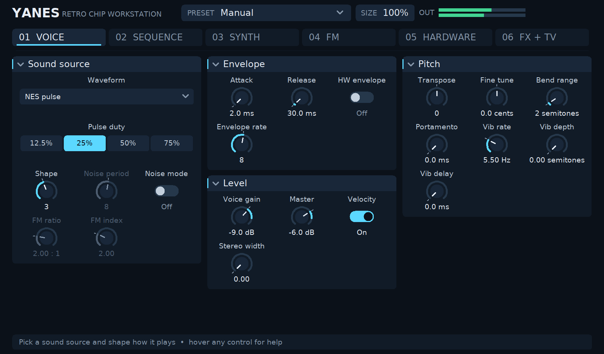

# YANES — Yet Another NES Audio Plugin

YANES is a clean-room CLAP instrument for NES and other retro console, computer, and arcade sounds.
It builds on Linux, Windows, and macOS and is designed for Bitwig Studio and other CLAP hosts. A
custom editor is included on all three platforms (X11 on Linux, Win32, and Cocoa).



## What is implemented

YANES is a polyphonic multi-chip synthesizer. Its core oscillator set covers NES pulse, triangle,
noise, and DPCM; VRC6, FDS, Namco 163, VRC7, and Sunsoft 5B expansions; Game Boy and Master System
voices; Genesis PSG and YM2612 FM; AY-3-8910, POKEY, PC Engine, OPL2/OPL3, OPN/OPNA, OPM, SID,
Konami SCC, Philips SAA1099, and Atari TIA. It also includes original morphing-wavetable,
phase-distortion, additive, six-operator FM, and digital-partial synthesis modes, plus stack modes
that map MIDI channels to multi-voice chip layouts.

The NES DPCM voice additionally supports a sixteen-slot bank: mono or stereo 16-bit WAV files are
converted to one-bit DPCM, while pre-encoded `.ydmc` data can be loaded directly. Slots map to
consecutive MIDI notes and can be looped, trimmed, and saved in CLAP project state.

The current instrument provides 12.5%, 25%, 50%, and 75% band-limited pulse waves, the NES
32-step triangle waveform, and the 2A03's 32,767-step and 93-step noise LFSRs with all 16 timer
periods. It includes 16-voice polyphony, velocity, attack/release, tuning, portamento, a pitch-bend
range of up to 48 semitones, automation, and project-state persistence.

Expansion-audio oscillator models include VRC6 pulse and saw, Famicom Disk System wavetable,
Namco 163 wavetable, VRC7-style two-operator FM, and Sunsoft 5B tone. Their **Shape**, **FM ratio**,
and **FM index** parameters are exposed for automation. These are compact musical models of each
chip's characteristic synthesis method, not register- or cycle-perfect emulators.

The plug-in also provides NES DPCM kick/snare synthesis, Game Boy pulse/wave/noise, Master System
tone/noise, Genesis PSG, and a register-driven four-operator Genesis FM model through ymfm. The console stack
modes route MIDI channels to hardware-style channels:

- NES channels 1–5: pulse 1, pulse 2, triangle, noise, DPCM
- Game Boy channels 1–4: pulse 1, pulse 2, wave, noise
- SMS channels 1–4: tone 1, tone 2, tone 3, noise
- Genesis channels 1–6: FM; 7–9: PSG tone; 10: PSG noise

Genesis FM voices now use the pinned BSD-3-Clause `ymfm` YM2612 core through real chip-register
writes rather than YANES's earlier sine-network approximation. Pitch uses block/F-number
quantization, and instrument setup drives operator multiplier, total level, key scale, attack,
decay, sustain, release, AM, hardware LFO, algorithm, feedback, stereo, and key-on registers. The
core runs at its native rate and is converted to the host rate. OPL2 and OPL3 modes now use the
same register-driven path, including hardware frequency numbers, key-on, operator envelopes,
waveforms, key scaling, channel connection, feedback, and OPL3 output routing. YM2203 OPN,
YM2608 OPNA, and YM2151 OPM modes also use their corresponding ymfm devices and native clock
rates. A neutral LFO initialization avoids the invalid maximum-PM startup trace caught by the
non-silence regression test.

The FM operator section exposes attack, decay, sustain rate, sustain level, release, detune, key
scaling, LFO rate, AM depth, and PM depth. Values are translated to each selected chip's actual
register widths; unsupported combinations such as OPL detune are intentionally ignored rather
than simulated outside the chip.

`yanes-register-render` renders timestamped hexadecimal register writes through ymfm at native
YM2612, YM2151, YM3812, or YMF262 rates. This provides a deterministic bridge for comparing YANES
against register logs and audio exported by Furnace without incorporating Furnace's GPL engine.
`yanes-audio-compare` checks two 16-bit PCM renders and reports normalized correlation and RMS
error. It resamples differing source rates and also reports 1024-frame energy-envelope correlation,
which is stable across different chip-core phase and resampling implementations. An optional
minimum envelope-correlation threshold is suitable for CI.

The 21-chip audio suite (`tools/compare_furnace_audio.sh`, fixtures under `tests/furnace/`) uses
`yanes-parity-compare`: onset alignment, log-band spectrum, octave-folded YIN pitch, and envelope
shape. A fixture only selects a voice and plays a note — duty, wavetable, noise settings, FM ratio
and release all come from the plugin's own per-voice defaults, so a passing row means the sound a
user gets from that voice matches the chip, not that the engine could be talked into it. Each of the
21 fixtures is also rendered an octave up and down as an untuned holdout; **all 63 cases pass**.
`yanes-parity-compare --self-test` runs as its own CTest to keep the gate from drifting into
something a wrong render could satisfy. Packaged Furnace 0.6.8.3 cannot load these INF2 modules;
configure `-DYANES_FURNACE_EXECUTABLE=` to a git Furnace **dev250+** binary. See `FURNACE_PARITY.md`.

`tools/compare_furnace.sh CHIP module.fur [minimum-correlation]` performs the complete external-oracle
workflow: Furnace per-system WAV and VGM export, register extraction, native ymfm replay,
and aligned audio comparison. `CHIP` is one of `ym2203`, `ym2608`, `ym2612`, `ym2151`, `ym3812`,
or `ymf262`. It uses temporary files and does not copy Furnace modules or audio
into YANES. The bundled Furnace `Equinox Intro` demo produced 61,323 YM2612 writes and an envelope
correlation of 0.940756 in the development environment; this observation is deliberately not a
hardcoded universal threshold because Furnace core selection and module features can differ.

The ROM-driven Game Boy gate uses a patched SameBoy checkout to run an actual `.gb`/`.gbc`
image once and capture both its reference audio and every APU register write. Build the capture
side with `SAMEBOY_SRC=/path/to/SameBoy tools/build_gb_oracle.sh`, then run
`tools/test_gb_rom_parity.sh /path/to/game.gb`. `yanes-gb-replay` independently decodes that
register stream through YANES's pulse, wave-RAM, and LFSR primitives and emits a mix plus four
isolated channels, so the gate identifies the diverging voice rather than hiding it in a mix.
The required, small SameBoy instrumentation is in
`third_party/sameboy-apu-register-log.patch`; no emulator source is incorporated into YANES.

The PC Engine equivalent uses `tools/build_libretro_host.sh` and a Beetle PCE
checkout patched with `third_party/beetle-pce-psg-register-log.patch`. Run
`tools/test_pce_rom_parity.sh game.pce`; the core's frame-local timestamps are
paired with the frontend frame index, then `yanes-pce-replay` reconstructs all
six HuC6280 channels from the real ROM's exact frequency, balance, wave-RAM,
DDA, noise, and channel-1-to-channel-0 LFO writes. Register events retain
sub-sample timing, and the replay models the original HuC6280's unipolar DAC,
ultrasonic wave accumulator, and zero-divider noise special case. ROM
comparisons use the comparator's `rom` mode: energy
contour and spectrum remain mandatory, while single-note YIN and boundary-onset
rules (undefined for polyphonic continuous music) are deliberately omitted.

NES uses the same libretro host with a Nestopia checkout patched by
`third_party/nestopia-apu-register-log.patch`. Build it with
`NESTOPIA_SRC=/path/to/nestopia tools/build_nes_oracle.sh`, then run
`tools/test_nes_rom_parity.sh game.nes`; `yanes-nes-replay` cycle-steps the
captured 2A03 pulse, triangle, noise, DMC, frame-counter, length, sweep, and
envelope state before applying the published nonlinear mixer curves.

All three real-ROM lanes can be enrolled in CTest with `-DYANES_GB_ROM=...`,
`-DYANES_PCE_ROM=...`, and `-DYANES_NES_ROM=...`. The ROMs and patched cores
stay external. The scripts reject silent captures and compare a smoothed
musical-energy contour plus log-band spectrum, avoiding a misleading raw-wave
correlation between emulators with different analog filters and reset phase.

POKEY modes now clock distinct 4-, 5-, 9-, and 17-bit polynomial generators and provide eight
AUDC-style tone/noise gating combinations. Fast clock selection and strict-mode 16-bit channel
pairing expand the earlier single-LFSR model. SID modes now combine quantized 12-bit triangle,
saw, pulse, and noise sources before filtering; the 6581 path adds reduced combined-waveform level,
neighboring-bit bleed, a nonlinear cutoff curve, and stronger saturation, while the 8580 path is
cleaner and more linear. These SID changes are clean-room approximations, not reSID integration.

Hardware controls include NTSC/PAL clocks, timer pitch quantization, a 15-step envelope, pitch
sweep, and tracker-like arpeggio sequences. The optional console/TV section supplies adjustable
sample-rate and bit-depth reduction, RF noise, 50/60 Hz hum, coupling/high-frequency filtering,
speaker drive, and stereo width. Set **Retro amount** to zero for the clean chip output.

The **Preset** parameter supplies clean NES, chord lead, DPCM kit, Game Boy, SMS, Genesis FM,
bedroom-CRT, and noisy-RF starting points without requiring a plugin-owned window.

The computer/arcade chip lab adds AY-3-8910/SSG tone and noise, Atari POKEY tone and 17-bit
polynomial noise, PC Engine 32-sample/5-bit wavetable sound, OPL2 two-operator FM, OPL3
four-operator FM, OPN/OPNA, and OPM. Stack modes provide useful channel layouts for PC-88,
PC-98, X68000, Atari, PC Engine, and Sound Blaster OPL3. Yamaha FM modes (YM2612, OPL2, OPL3,
OPN/OPNA, OPM) write registers through ymfm. The remaining chip names are compact musical models
of each synthesis method, not register- or cycle-perfect emulators.

The PC Engine stack routes channels 1–4 to wavetable voices and channels 5–6 to its 18-bit noise
generator. PC-98 routes channels 1–6 to FM, 7–9 to SSG, 10–15 to synthesized rhythm (kick, snare,
tom, hats, cymbal), and 16 to the DPCM/sample bank used as an ADPCM stand-in. X68000 routes
channels 1–8 to OPM and channel 9 to the same sample bank. Since MIDI has sixteen channels, the
OPL3 stack exposes sixteen simultaneously addressable 2-operator parts rather than all eighteen
hardware channels. The dedicated OPL3 four-operator mode programs a true 4-operator channel pair.

Four additional families are included because they add synthesis methods not already covered:

- Commodore SID 6581/8580 combines saw/pulse synthesis with revision-dependent resonant nonlinear
  filtering. **Chip cutoff** and **Chip resonance** control that filter.
- Konami SCC supplies five channels of 32-sample, 8-bit wavetable sound.
- Philips SAA1099 supplies six tone channels, shared noise coloration, and the wide Game
  Blaster/SAM Coupé character.
- Atari TIA supplies two channels of deliberately coarse polynomial tones.

## Original retro-digital synthesis

Five additional methods broaden the instrument without copying factory ROMs or commercial
presets:

- **Morphing wavetable** moves continuously through sine-, triangle-, saw-, and pulse-derived
  tables. Table Position selects the region and Table Warp bends phase distribution.
- **Phase distortion** reshapes oscillator phase around a movable breakpoint for sharp brass,
  hollow reed, and resonant mid-1980s digital timbres.
- **Harmonic additive** sums twelve partials. Harmonic Tilt controls spectral rolloff and Table
  Position balances odd and even harmonics.
- **Six-operator FM** supplies a compact 32-routing family with modulation index and brightness.
  It follows the six-operator/32-algorithm concept without reproducing factory voices.
- **Digital partial pair** layers a generated transient with morphing-table and additive sustain
  components for late-1980s digital/analog-style patches.

Original presets include Vector Wavetable Pad, Phase-Distortion Brass, Additive Drawbars,
Six-Operator Electric Piano, and Digital Partial Strings.

Six era-inspired keyboard modes extend that original section without copying factory ROMs or
patch data: a deliberately compact two-operator Porta FM voice, detuned vintage analog poly,
envelope-swept matrix brass, quantized early-digital ensemble, electromechanical tine model, and
nonlinear ladder-style mono synth. The Porta FM mode follows the broad low-cost OPLL/portable-
keyboard synthesis approach but is not an emulation of a specific PSR model. Matching original
presets provide portable FM piano and organ, Japanese analog poly, American matrix brass, early
sampler choir, suitcase tine piano, and classic ladder bass starting points.

The Retro Chip Drum Kit maps twelve synthesized percussion voices from MIDI note 36 through 47:
swept sine kick, LFSR snare, PSG tom, metallic FM tom, closed and open noise hats, multi-burst clap,
SID-style zap, POKEY metallic hit, dual-square cowbell, TIA click, and arcade noise burst. These are
generated by the engine without sample ROMs. Shape changes their global character, pitch controls
transpose the kit, velocity controls level, and every hit decays automatically for DAW piano-roll use.

## Performance, layering, and retro rack

The Layer control can add an octave, fifth, sub-octave, stepped triangle, or noise component to any
chip or synthesis mode. Layer Mix keeps the recipe usable as either subtle reinforcement or an
obvious fake multi-channel stack. Vibrato supports direct automation, MIDI modulation wheel, and
Bitwig modulation. MIDI pitch bend and mod wheel act independently on each channel; the bend range
defaults to two semitones and is adjustable up to 48. CLAP note expressions provide
sample-accurate per-note tuning, volume, brightness, and pressure. Bitwig transport tempo can sync
the arpeggiator and echo. Eight programmable pitch steps support tracker-style riffs, and Strict
Hardware mode chokes an existing voice when a hardware-stack channel is retriggered.

The internal effects rack contains soft drive, a feedback echo, and stereo modulated chorus. These
run alongside the existing console/TV section, allowing a clean chip source, a tracker-like fake
echo, a worn stereo digital effect, or the full RF/television treatment without extra devices.

Technique presets demonstrate common chiptune arrangements with original settings: Envelope Bass
Trick, Hyper Arpeggio Lead, Duty-Cycle Lead, Fake Echo Lead, Octave Power Bass, and Worn Chorus Pad.
They are inspired by general tracker and cartridge-era techniques and contain no game samples or
extracted instrument data.

The embedded editor opens at 1600 x 1050 and can be freely resized down to 800 x 525; text,
controls, and hit-testing scale with the window. The **SIZE** button in the header steps through
50%, 60%, 75%, 90%, 100%, and 125% for hosts without a resize handle (click steps smaller and
wraps, the wheel goes either way, right-click restores 100%), and the project remembers the size. Seven pages group controls by what you are
adjusting — Voice, Sequence, Synth, FM, Hardware, FX + TV, and Custom — in collapsible cards, with the
preset selector always in the header. Controls that do nothing for the current sound source stay
in place but are dimmed, so the layout never jumps when the source changes.

- **Knobs**: drag up or down (Shift for fine), double-click, Ctrl/Cmd-click, or right-click to
  reset, and use the wheel to nudge.
- **Choices**: short lists are segmented buttons; long ones (sound source, preset, arpeggio,
  layer) open a pop-up list.
- **Step lanes** (Sequence page): drag to paint pitch, duty, or cents steps, right-drag to draw a line,
  right-click a step to reset it, and click or drag the ruler to set how many steps play.
- **Page artwork**: a live oscilloscope and spectrum, wavetable and filter previews, FM routing,
  and the channel mixer and DPCM slot tiles.

Every edit is a complete CLAP begin/value/end gesture, one per parameter touched. Host automation
and Bitwig's native panel update the same parameter state and redraw the editor. Page and
collapse changes animate briefly and the editor repaints only while something changes; on
Linux it draws into a back buffer, so it never shows a half-painted frame. Linux uses X11/Xft
(including under XWayland), Windows uses GDI, and macOS uses a flipped Cocoa view.
`yanes-ui-preview OUTPUT_DIR [WIDTH HEIGHT]` renders every page to PNG offscreen for layout review.
On Linux, `build/frontend_tests --display-review /tmp/yanes-native-review` checks the production
editor at four sizes with repeated window lifecycles and saves PPM screenshots. It requires an
X display; the ordinary CTest frontend checks remain headless. See the
[native UI and leak results](docs/REVIEW_2026-09-26.md#follow-up-native-ui-and-leak-checks).

The catalogue contains **59 sound sources and 81 factory presets** (plus Manual). Every source
has a factory starting preset, including the console stacks and noise voices. New recipes include
Custom wave lead, Game Boy custom bass, Custom wave organ, and Game Boy duty macro. Choose
**Custom wavetable** directly in the sound-source menu, or use the Custom wave switch to override
another source. The drawing is always active when Custom wavetable itself is selected.

The **Custom** page lets you draw a repeating 32-sample, 4-bit waveform, matching Game Boy
wave-RAM resolution. Enable **Custom wave** to replace any selected source's oscillator
(including every part of a stack) with the drawing. Pitch, envelopes, layers, mixer and effects
still apply; source-specific synthesis controls are dimmed. Drag to paint, right-drag for a
straight line, and right-click a sample to reset it. Fast strokes fill intervening samples.
The fixed-length ruler labels the samples. Every sample is automatable and saved with the project;
older projects load with Custom wave off. Selecting a factory preset resets the drawing and switch.
This is a creative oscillator override, not a claim that every original chip supported wave RAM.

The **duty sequence** steps a pulse voice's duty through up to eight steps on every note, like a
tracker duty macro: looping or one-shot, at a free rate or locked to host tempo with the sync
division. It applies to NES, Game Boy, and SID pulses and to the NES stack's two pulse channels.
The **cents sequence** works the same way on fine pitch: up to eight steps of ±100 cents for
detuned chirps, slides into a note, or a stepped chorus wobble, on every sound source, and it
stacks on top of the arpeggio. **Vibrato delay** holds the vibrato off for up to three seconds after
each note starts and then brings it in from zero phase, like a tracker's delayed
vibrato; mod-wheel vibrato stays immediate.
**Pitch bend range** sets the wheel's range from 0 to 48 semitones (default 2); selecting a preset
keeps it. Parameter display text parses back, so typing a value a host shows (a sound-source name,
"50%", "C2 (36)") works.

MIDI CC7 controls volume
independently on each channel, including stack parts. The CLAP latency and tail extensions report
zero processing latency and a release/echo-dependent tail so offline hosts do not truncate decays.

## NES DPCM sample bank

Yes, sample import is implemented, but only for this bank. `yanes-dpcm` converts a mono or stereo
16-bit PCM WAV to the one-bit delta stream used by the NES DPCM modes:

```sh
build/yanes-dpcm input.wav sample.ydmc
YANES_DPCM_BANK="$PWD/kick.ydmc:$PWD/snare.ydmc:$PWD/tom.ydmc" bitwig-studio
```

WAV input is mixed to mono and converted at 16,744 Hz, the fastest NTSC 2A03 DPCM rate. The plug-in
reads WAV or `.ydmc` bank entries during initialization, never on the audio thread.
You can also middle-click a slot on the Hardware page to choose a mono/stereo 16-bit PCM WAV or
`.ydmc` file, right-click it to clear it, and left-click it to toggle looping. Sample replacement
uses immutable snapshots, so a sounding voice safely finishes with its original sample while a new
voice receives the replacement. Once Bitwig saves the
project, all sixteen bank slots are included in CLAP state, so reopening that project does not
depend on the environment variable or original files. DPCM Base Key maps consecutive MIDI keys to
slots; each file is limited to 1 MiB. Empty slots retain the generated, copyright-free kick/snare
fallback. State versions 8 and 9 migrate their former single sample into slot one, while versions
10 through 15 retain all sixteen slots and receive defaults for newer mixer, loop, DAC, trim,
and later controls.
Each slot can loop independently through the DPCM Loop Mask, and DPCM Initial Level exposes the
2A03 DAC starting value used before the first delta bit. DPCM Trim Start and Trim End provide
normalized, non-destructive start/end boundaries shared by the bank; they are not per-sample loop
points or a waveform editor. The Hardware page shows loaded slots in amber and looping slots in
green. The graphical file chooser uses `zenity` on Linux, `GetOpenFileName` on Windows, and
`NSOpenPanel` on macOS; the environment-variable workflow does not require a chooser.

The Hardware page includes a sixteen-channel stack mixer strip. Left-clicking a channel toggles
mute and right-clicking toggles solo, with both masks exposed to Bitwig automation and stored in
the project. MIDI sustain pedal, All Sound Off, and All Notes Off are handled for both generated
and register-driven voices.

## Build

YANES requires CMake 3.20 or newer and a C++20 compiler. Linux additionally requires X11
development headers, Xft, and pkg-config. On Debian or Ubuntu, install the system dependencies
with:

```sh
sudo apt install build-essential cmake pkg-config libx11-dev libxft-dev
```

On Arch Linux (or an Arch-based distribution), install the equivalent dependencies with:

```sh
sudo pacman -S --needed base-devel cmake pkgconf libx11 libxft git
```

Then configure, build, and run the test suite:

```sh
cmake -S . -B build -DCMAKE_BUILD_TYPE=Release
cmake --build build -j
ctest --test-dir build --output-on-failure
```

The same commands work from a Visual Studio developer shell on Windows and from a current Xcode
command-line-tools environment on macOS. Use `--config Release` for a multi-configuration CMake
generator. Cross-platform CI and release-promotion details are in
[`docs/CROSS_PLATFORM_RELEASES.md`](docs/CROSS_PLATFORM_RELEASES.md).

When REAPER is installed, CMake registers `reaper_clap_integration`. The test creates an isolated
REAPER profile, instantiates YANES, writes a MIDI drum passage and waveform automation, saves and
recalls the project, renders it offline, and validates the WAV:

```sh
ctest --test-dir build --output-on-failure -R reaper_clap_integration
```

CMake downloads the small official CLAP headers. For an offline build, pass
`-DCLAP_ROOT=/path/to/clap`. It also fetches the pinned `ymfm` source used by the hardware FM
models, so the first online configuration requires Git and network access.

### Review and CPU measurements

The September 2026 review and its validation limits are recorded in
[`docs/REVIEW_2026-09-26.md`](docs/REVIEW_2026-09-26.md). Hardware-FM pitch corrections make
YM2612/OPNA play an octave higher and OPM a semitone lower than the buggy earlier implementation,
so existing patches using those sources now follow the intended MIDI pitch. Parameter IDs and
saved-state migration remain compatible.

`build/yanes-benchmark build/YANES.clap` prints per-source CPU measurements at 48 kHz, 128-frame
blocks, and one or sixteen active MIDI voices. It excludes activation, note setup and warm-up;
it is an informational throughput measurement, not a DAW dropout guarantee.

The `nes_preset_gate` test scans `NES_ROM_DIR` (default `/mnt/crucial/roms/nes`) and selects a
filename-derived score for comparison against a separate local APU model. It restores the
`tonal 0.95` envelope/spectrum/pitch and onset/offset gate, prints audio comparison diagnostics,
and saves `rom_song.rpp`, `rom_extracted.wav`, and `yanes_extracted.wav` under
`build/reaper_projects/`. It does not run a ROM or extract game music.
Actual ROM capture/replay remains in the optional `*_rom_parity`
gates described above. Full ROM mixes use `rom-mix` comparison, which rejects silence without
requiring ffmpeg; `rom` permits silent isolated channels that an excerpt does not use.

## Install

### Local build and install

After building from source, copy the compiled `YANES.clap` plug-in to your platform's standard CLAP directory:

| Platform | Built file location | Copy destination |
| --- | --- | --- |
| Linux | `build/YANES.clap` | `~/.clap/` (or `/usr/lib/clap/`) |
| Windows | `build\Release\YANES.clap` | `C:\Program Files\Common Files\CLAP\` |
| macOS | `build/YANES.clap` (bundle) | `~/Library/Audio/Plug-Ins/CLAP/` |

**Linux**:
```sh
mkdir -p ~/.clap
cp build/YANES.clap ~/.clap/
```
*(Or system-wide: `sudo cp build/YANES.clap /usr/lib/clap/`)*

**macOS**:
```sh
mkdir -p ~/Library/Audio/Plug-Ins/CLAP
cp -R build/YANES.clap ~/Library/Audio/Plug-Ins/CLAP/
```
*(Note: on macOS, `YANES.clap` is a bundle directory, so copy recursively with `-R`. When using multi-configuration generators like Xcode, the bundle is located in `build/Release/YANES.clap`.)*

**Windows** (PowerShell):
```powershell
New-Item -ItemType Directory -Force -Path "$env:CommonProgramFiles\CLAP"
Copy-Item build\Release\YANES.clap "$env:CommonProgramFiles\CLAP\"
```
*(Or from Command Prompt: `if not exist "%COMMONPROGRAMFILES%\CLAP" mkdir "%COMMONPROGRAMFILES%\CLAP"` followed by `copy build\Release\YANES.clap "%COMMONPROGRAMFILES%\CLAP\"`)*

#### Companion CLI tools (optional)

The build also creates command-line utilities (`yanes-dpcm`, `yanes-register-render`, `yanes-audio-compare`, etc.). You can install them into your local PATH using CMake:

```sh
cmake --install build --prefix ~/.local
```
*(Or system-wide: `sudo cmake --install build --prefix /usr/local`)*

### Prebuilt binary

Download a prebuilt package from the
[Releases page](https://github.com/andrewfader/yanes/releases/latest):

| Platform | Package | Copy `YANES.clap` to |
| --- | --- | --- |
| Linux x86-64 | `YANES-<version>-linux-x64.tar.gz` | `~/.clap/` (or `/usr/lib/clap/`) |
| Windows x64 | `YANES-<version>-windows-x64.zip` | `C:\Program Files\Common Files\CLAP\` |
| macOS (Apple Silicon and Intel) | `YANES-<version>-macos-universal.zip` | `~/Library/Audio/Plug-Ins/CLAP/` |

On Linux, for example:

```sh
tar xzf YANES-*-linux-x64.tar.gz
mkdir -p ~/.clap
cp YANES-*-linux-x64/YANES.clap ~/.clap/
```

The Linux build needs only the X11 and Xft libraries that every desktop distribution ships. The
Windows and macOS release packages are unsigned; if macOS refuses to load a downloaded plug-in, clear its quarantine flag:

```sh
xattr -dr com.apple.quarantine ~/Library/Audio/Plug-Ins/CLAP/YANES.clap
```

Pushing a `v*` tag runs `.github/workflows/release.yml`, which builds and tests every platform and
publishes the packages with SHA-256 checksums.

### DAW setup

After installing, rescan plug-ins in your DAW:
- **Bitwig Studio**: Open **Settings > Locations > Plug-in Locations** and click **Rescan Plug-ins** (or restart Bitwig).
- **REAPER**: Open **Preferences > Plug-ins > VST/CLAP** and click **Re-scan**.

Then insert **YANES** onto a track from your host's instrument browser.

## Scope and provenance

This project implements published chip behavior using clean-room code. The built-in DPCM drums are
generated at runtime and contain no samples from commercial games. Imported material remains the
user's responsibility.

## License

This project is licensed under the [YANES Source-Available License](LICENSE).

- **Personal & Evaluation Use**: Free to view, compile, and use for personal, non-commercial, or evaluation purposes with attribution.
- **Notification**: Users redistributing or adapting this project for public release must notify the author.
- **Commercial Use & Licensing**: Commercial use, embedding, or commercial redistribution requires explicit prior authorization from the author. The author reserves the right to deny permission or require a negotiated licensing fee.
